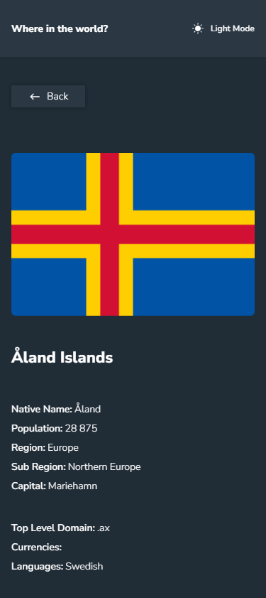

# Frontend Mentor - REST Countries API with color theme switcher solution

This is a solution to the [REST Countries API with color theme switcher challenge on Frontend Mentor](https://www.frontendmentor.io/challenges/rest-countries-api-with-color-theme-switcher-5cacc469fec04111f7b848ca).

## Table of contents

-   [Overview](#overview)
    -   [The challenge](#the-challenge)
    -   [Screenshot](#screenshot)
    -   [Links](#links)
-   [My process](#my-process)
    -   [Built with](#built-with)
    -   [Useful resources](#useful-resources)
-   [Author](#author)

## Overview

### The challenge

Users should be able to:

-   See all countries from the API on the homepage
-   Search for a country using an `input` field
-   Filter countries by region
-   Click on a country to see more detailed information on a separate page
-   Click through to the border countries on the detail page
-   Toggle the color scheme between light and dark mode _(optional)_

### Screenshot

### Links

-   Solution URL: [Add solution URL here](https://your-solution-url.com)
-   Live Site URL: [https://rest-countries-pi.vercel.app/](https://rest-countries-pi.vercel.app/)

## My process

### Built with

-   Flexbox
-   CSS Grid
-   Mobile-first workflow
-   [React](https://reactjs.org/) - JS library
-   [Redux Toolkit](https://redux-toolkit.js.org/) - For state control
-   [React Router Dom v6](https://reactrouter.com/docs/en/v6) - For routes
-   [Styled Components](https://styled-components.com/) - For styles
-   [Framer](https://www.framer.com/docs/introduction/) - For animations
-   [Axios](https://axios-http.com/docs/intro) - For requests

### Useful resources

-   [Dave Gray](https://www.youtube.com/watch?v=u3KlatzB7GM&t=665s) - This Youtube channel helped me to understand more about React Redux Toolkit.
-   [The Net Ninja](https://www.example.com) - This free course taught me how to use the framer library.

## Author

-   Linkedin- [Gabriel Pinheiro](https://www.linkedin.com/feed/)
-   Frontend Mentor - [@GabrielFMPinheiro](https://www.frontendmentor.io/profile/GabrielFMPinheiro)
-   Email - g.felippe5965@gmail.com
